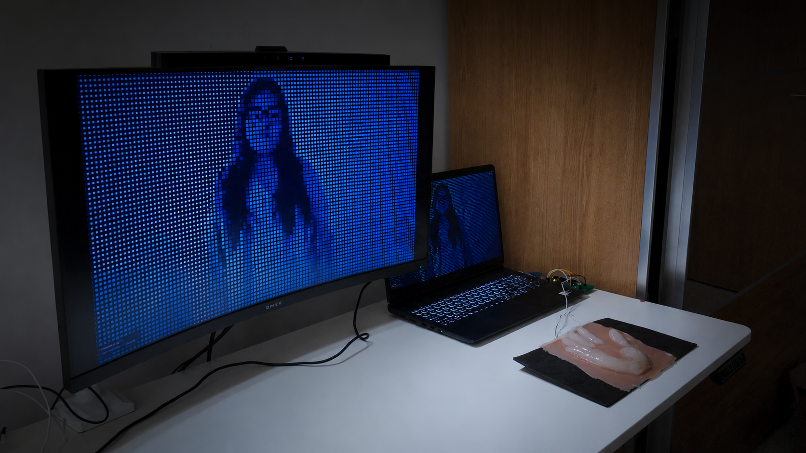

# Hold Me Down

## Demonstration Shots

**Author:** Jialin Xin  
**Date:** July 2026



*Demonstration of the live body-segmentation and visual fragmentation effect.*


*Participant pressing the silicone hand to control the digital body.*

---

## Short Description

*Hold Me Down is an interactive installation that translates physical pressure into the fragmentation of a live digital body. By pressing a silicone cast of the artist’s hand, the participant causes parts of their detected body image to tremble, detach and fall.*

*When the pressure is released, the body gradually regenerates.*

---

## Concept

*This project explores the relationship between physical touch, emotional pressure, bodily vulnerability and recovery.*

The participant stands in front of a camera while their body is detected through machine vision. A silicone hand containing an FSR pressure sensor becomes the physical interface between the participant and the digital image.

When the participant presses the hand, the pressure value is sent from Arduino to the browser. Increasing pressure causes the square tiles inside the detected body to shake, detach and fall. The environment remains comparatively stable.

The work presents the digital body as something that can be physically controlled, fragmented and reconstructed through touch.

---

## Technology Used

- **p5.js** — visual rendering and interaction
- **ml5.js Body Segmentation** — live participant detection
- **Arduino Mega 2560** — sensor data processing
- **FSR pressure sensor** — physical pressure input
- **Web Serial API** — communication between Arduino and browser
- **HTML, CSS and JavaScript**
- **Silicone hand interface**

---

## How to Run / Install

Hold Me Down requires a camera, an Arduino and an FSR pressure sensor.

| Action | What Happens |
|---|---|
| 📷 Stand in front of the camera | The participant’s body is detected |
| 🔌 Connect the Arduino | The browser receives pressure data |
| 🖱️ Click **SENSOR** | Opens the serial-port connection |
| ✋ Press the silicone hand | Body tiles begin to tremble and fall |
| ⬆️ Apply more pressure | More body tiles detach |
| ⬇️ Release the pressure | The digital body gradually regenerates |
| ⌨️ Press `D` | Shows or hides the body-mask debug view |
| ⛶ Press `F` | Enters or exits fullscreen mode |
| 🖱️ Hold and move the mouse horizontally | Tests pressure without Arduino |

### Arduino Setup

1. Connect the FSR circuit to analog pin `A0`.
2. Open the Arduino file in Arduino IDE.
3. Select **Arduino Mega or Mega 2560**.
4. Select the correct serial port.
5. Upload the Arduino code.
6. Close the Arduino Serial Monitor and Serial Plotter.

### FSR Circuit

```text
5V
 │
FSR
 │
 ├──── A0
 │
10 kΩ resistor
 │
GND
